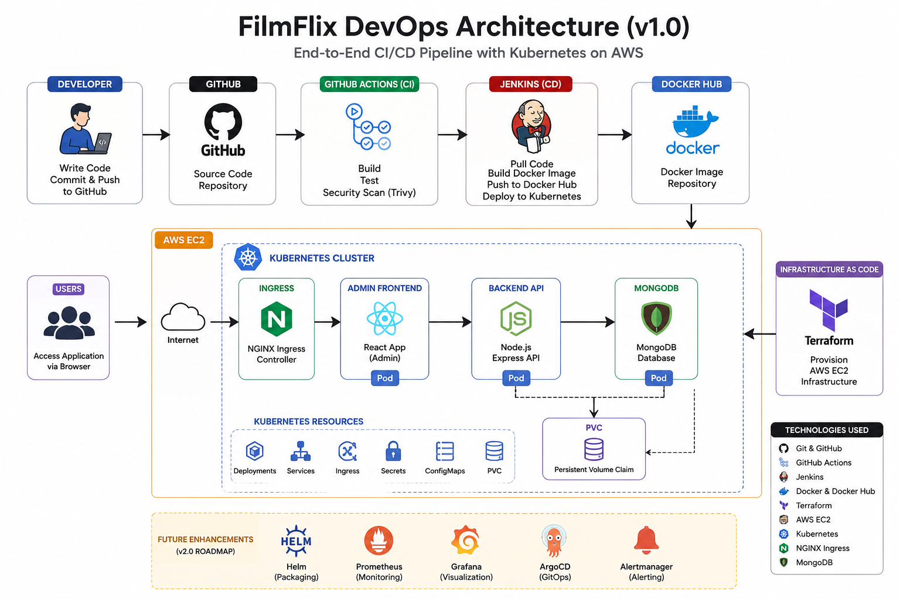
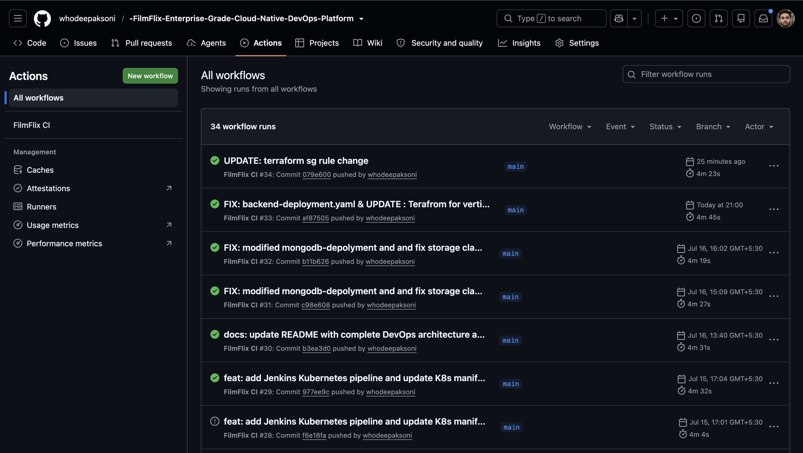
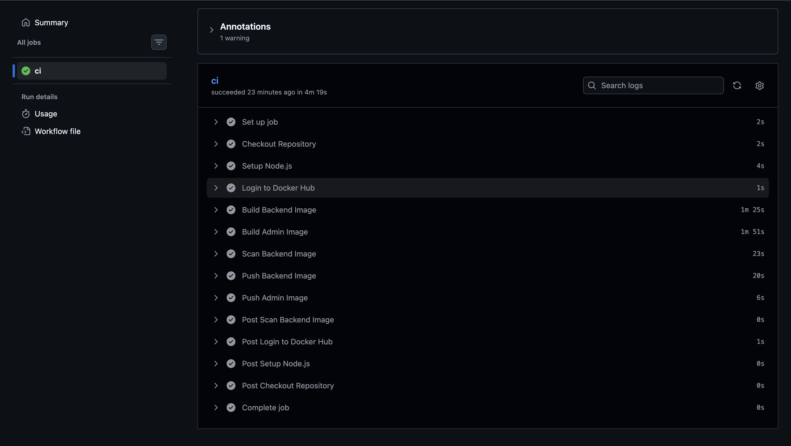
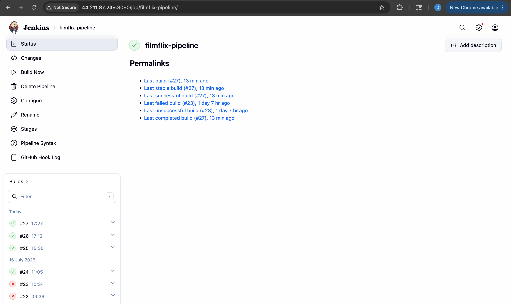
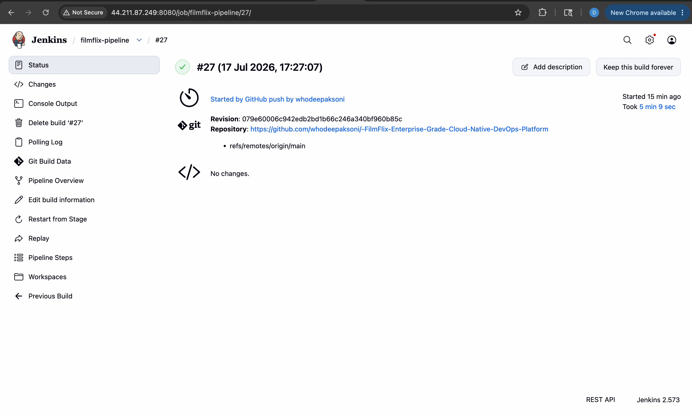
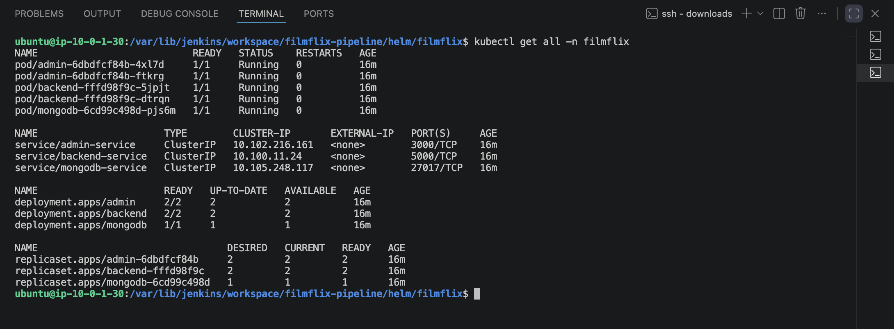
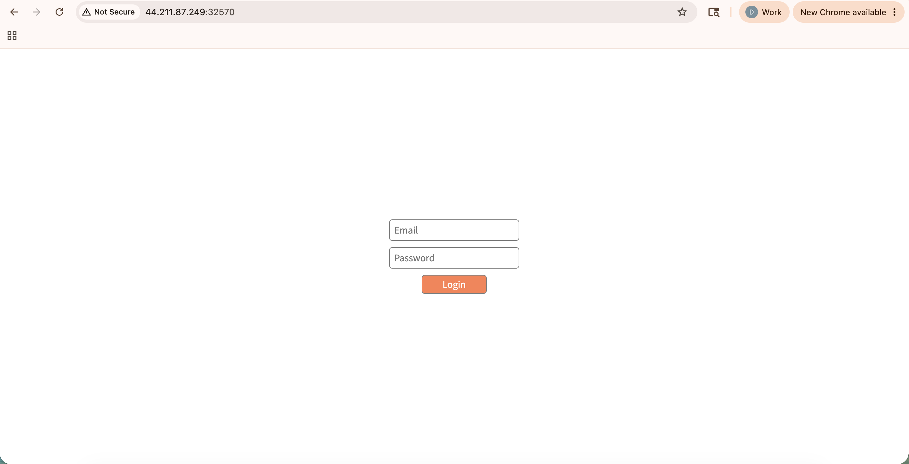

# 🎬 FilmFlix - Enterprise Grade Cloud Native DevOps Platform

A complete end-to-end Cloud Native DevOps project demonstrating modern CI/CD, Infrastructure as Code, containerization, and Kubernetes deployment on AWS.

---

# 🏗️ Architecture Diagram

---

# 🚀 Project Overview

FilmFlix is a Netflix-inspired web application deployed using a complete DevOps pipeline.

The project covers the complete software delivery lifecycle from source code management to automated deployment on Kubernetes.

---

# 🛠 Tech Stack

### Cloud
- AWS EC2

### Infrastructure as Code
- Terraform

### Version Control
- Git
- GitHub

### CI/CD
- GitHub Actions
- Jenkins

### Containers
- Docker
- Docker Compose

### Container Orchestration
- Kubernetes

### Database
- MongoDB

### Backend
- Node.js
- Express.js

### Frontend
- React.js

---

# 📂 Project Structure

Project-Flimflix/
│
├── admin/
├── client/
├── routes/
├── models/
├── middleware/
├── k8s/
├── terraform/
├── .github/workflows/
├── Dockerfile
├── docker-compose.yml
├── Jenkinsfile
└── README.md

---

# ⚙ Features

- Infrastructure provisioning using Terraform
- Automated CI using GitHub Actions
- Automated CD using Jenkins
- Dockerized application
- Docker Compose deployment
- Kubernetes Deployments
- Kubernetes Services
- Ingress Controller
- Persistent Volume Claim (PVC)
- StorageClass
- MongoDB Deployment
- End-to-End CI/CD Pipeline

---

# 🔄 CI/CD Workflow
Developer
↓
Git Push
↓
GitHub
↓
GitHub Actions
↓
Jenkins
↓
Docker Build
↓
Docker Hub
↓
AWS EC2
↓
Kubernetes Cluster

---

# 📦 Kubernetes Resources

- Namespace
- Deployment
- Service
- Ingress
- Secret
- Persistent Volume Claim
- Storage Class

---
# 🌐 Application Access

Admin Application

http://<EC2-Public-IP>

Backend API

http://<EC2-Public-IP>:<NodePort>

---

# 📸 Screenshots

## GitHub Actions
, 
 

## Jenkins Pipeline
, 

## Terraform Infrastructure

## Kubernetes all

## Application

## Backend API

---

# 🚀 Future Improvements (Version 2)

- Helm Charts
- Prometheus
- Grafana
- ArgoCD
- GitOps Deployment
- Monitoring & Alerting

---

# 👨‍💻 Author

Deepak Soni

GitHub:
https://github.com/whodeepaksoni

LinkedIn:
https://www.linkedin.com/in/whodeepaksoni/
